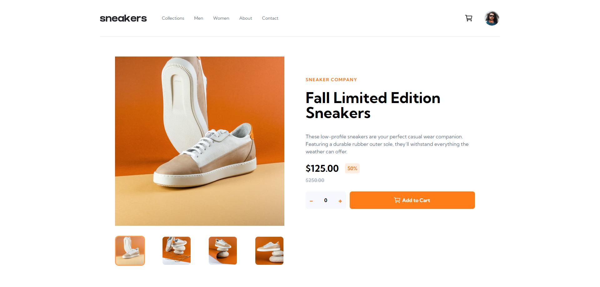

# Frontend Mentor - E-commerce product page solution

This is a solution to the [E-commerce product page challenge on Frontend Mentor](https://www.frontendmentor.io/challenges/ecommerce-product-page-UPsZ9MJp6).

## Table of contents

- [Overview](#overview)
    - [The challenge](#the-challenge)
    - [Screenshot](#screenshot)
    - [Links](#links)
- [My process](#my-process)
    - [Built with](#built-with)
    - [Useful resources](#useful-resources)

## Overview

### The challenge

Users should be able to:

- View the optimal layout for the site depending on their device's screen size
- See hover states for all interactive elements on the page
- Open a lightbox gallery by clicking on the large product image
- Switch the large product image by clicking on the small thumbnail images
- Add items to the cart
- View the cart and remove items from it

### Screenshot

### Links

- Solution URL: [https://www.frontendmentor.io/solutions/scalable-and-responsive-product-page-made-using-nextjs-and-tailwindcss-aa4-c-tfg5](https://www.frontendmentor.io/solutions/scalable-and-responsive-product-page-made-using-nextjs-and-tailwindcss-aa4-c-tfg5)
- Live Site URL: [https://e-commerce-page-lime.vercel.app/](https://e-commerce-page-lime.vercel.app/)

## My process

### Built with

- [Next.js](https://nextjs.org/) - React framework
- [Tailwind CSS](https://tailwindcss.com/) - For styles
- [React Icons](https://react-icons.github.io/react-icons/) - Icon library

### Useful resources

- [NextJS & OpenAI - 2024 Edition - By John Smilga](https://www.udemy.com/course/nextjs-open-ai/) - This online course helped me get a good understanding of building web apps using Next.js.
- [Tailwind CSS documentation](https://tailwindcss.com/docs/) - This is an amazing article which helped me finally understand XYZ. I'd recommend it to anyone still learning this concept.
